## Patient UI 

### 1. Login for Patient
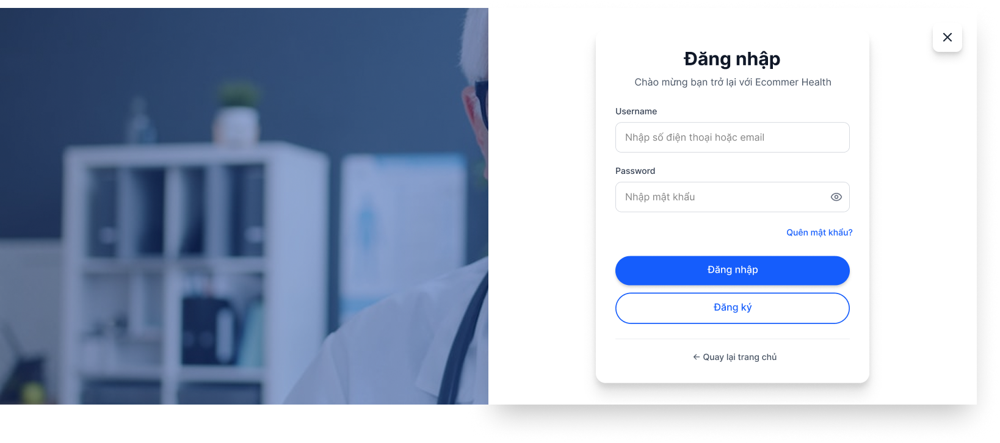

### 2. Register Account
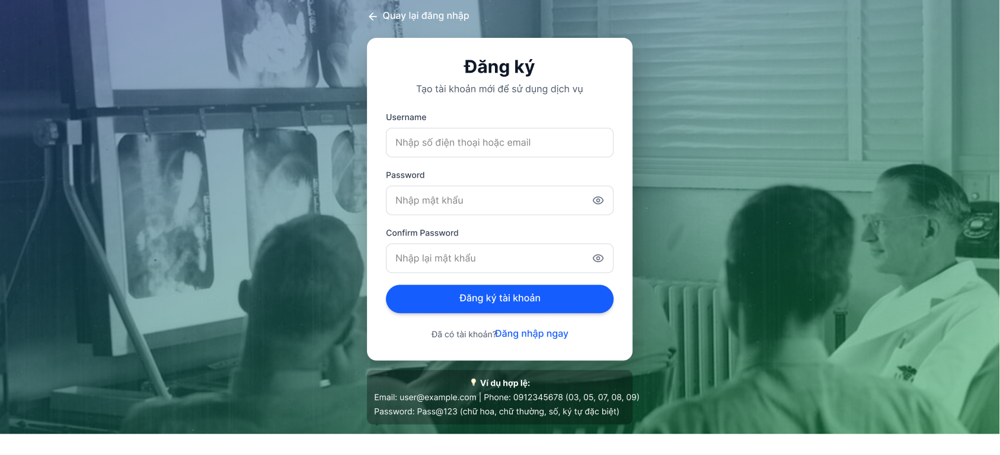

### 3. Forgot Password
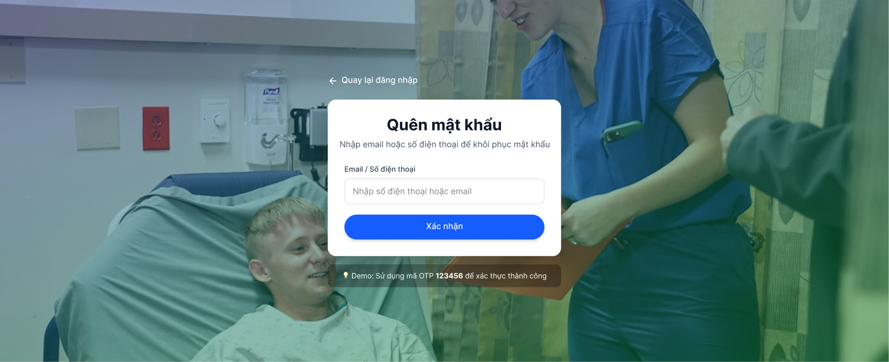

### 4. OTP Verification
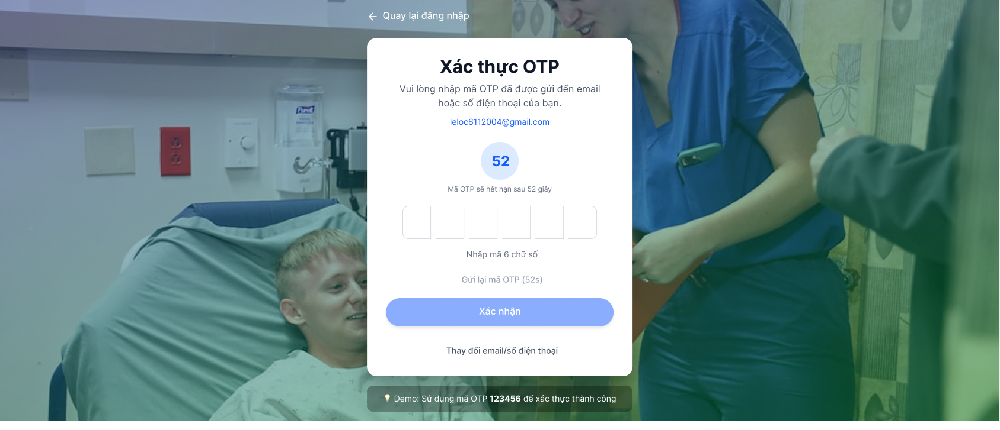

### 5. Login Success with User
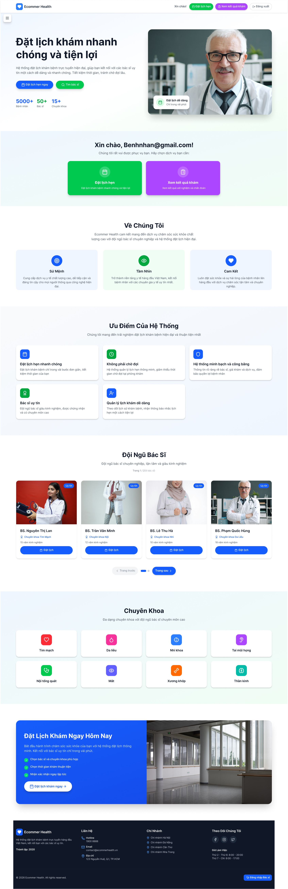

### 6. Book Appointment
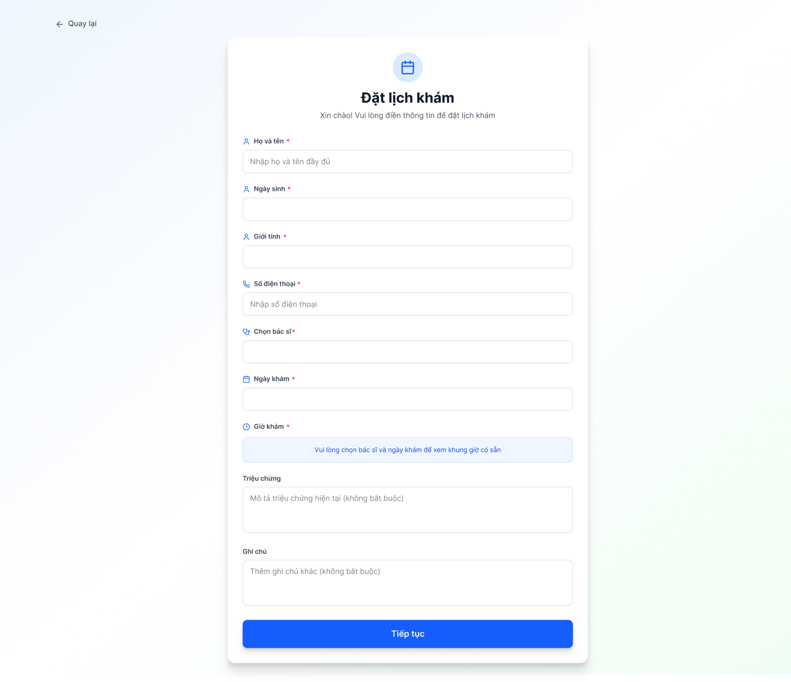

### 7. View Appointment Details
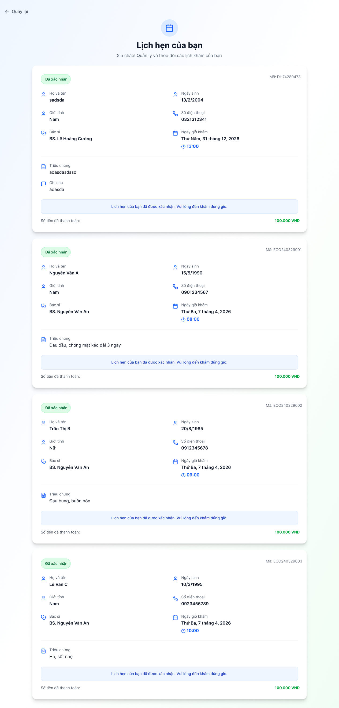

### 8. Make Deposit
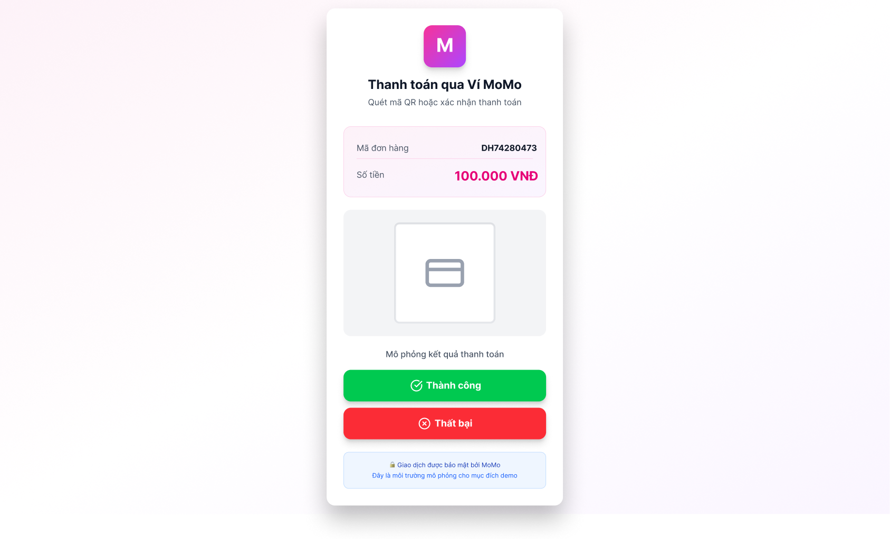

### 9. Payment
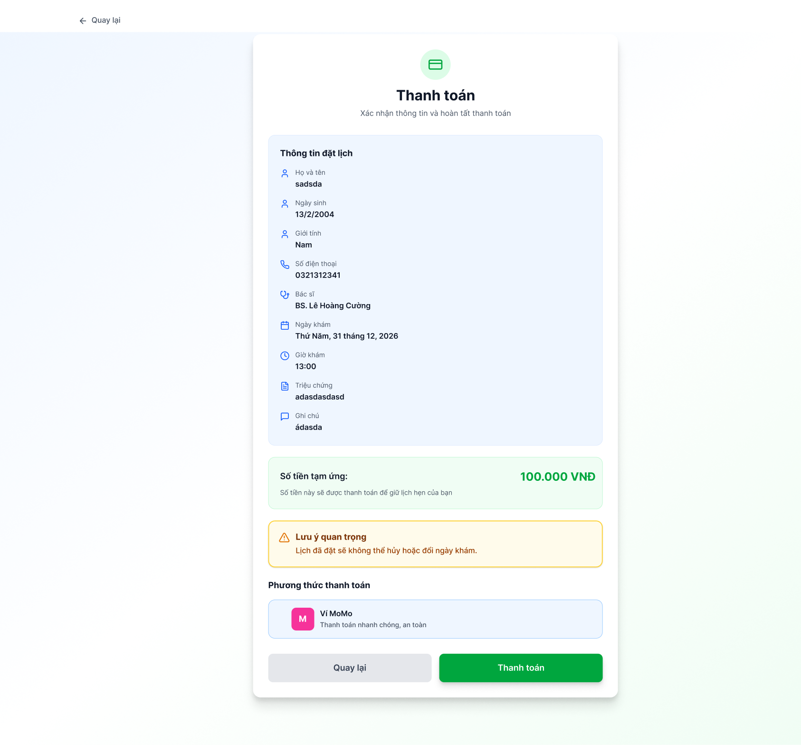

### 10. View Medical Results
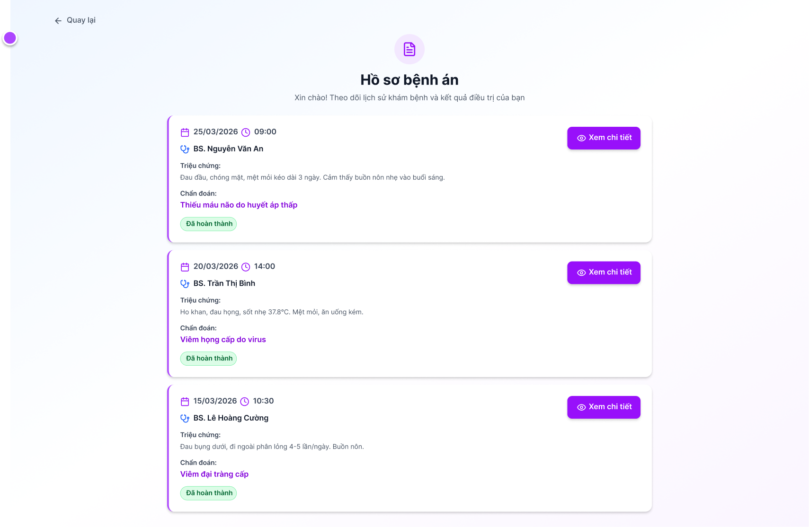

### 11. View Medical Result Details
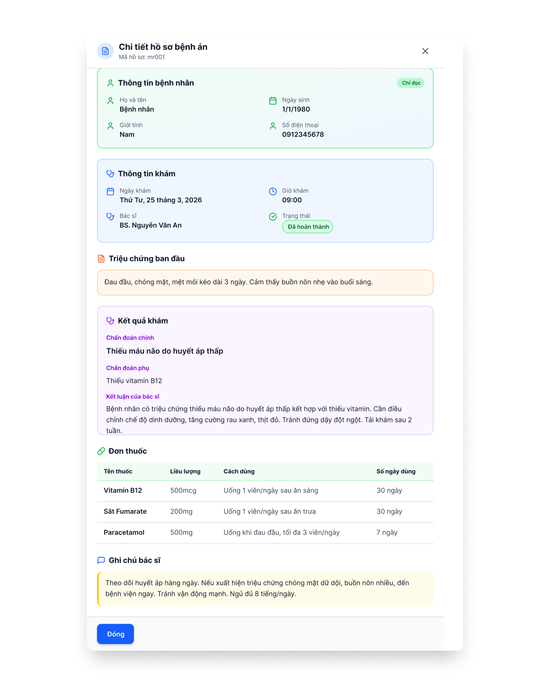
